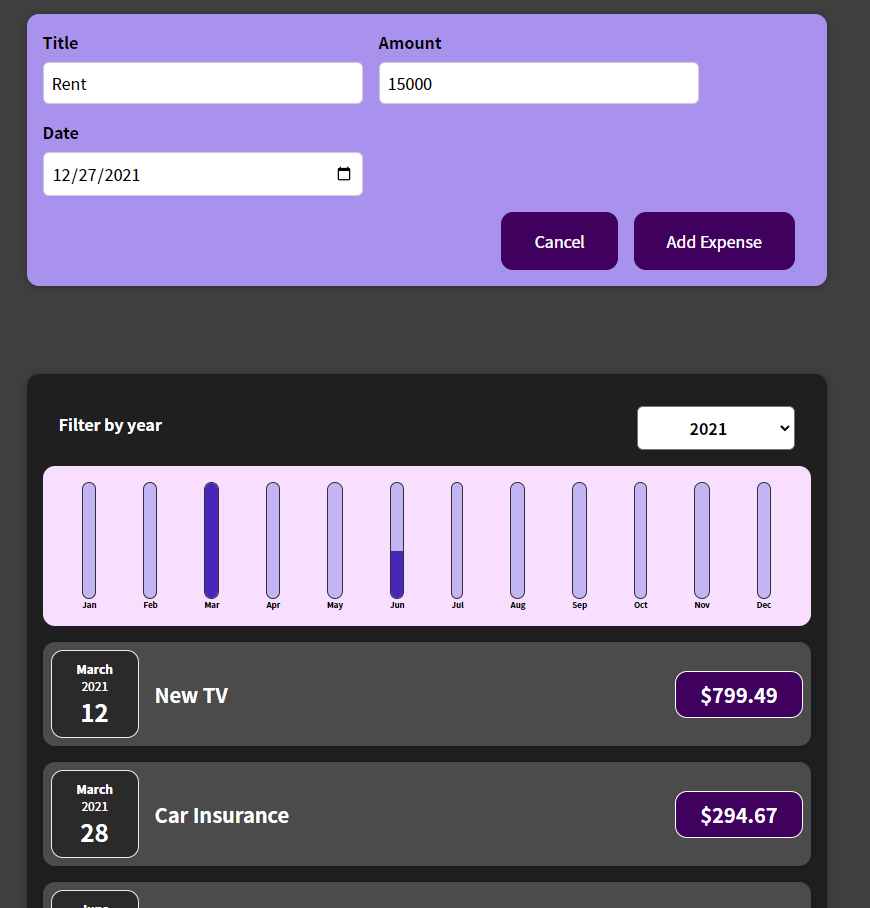
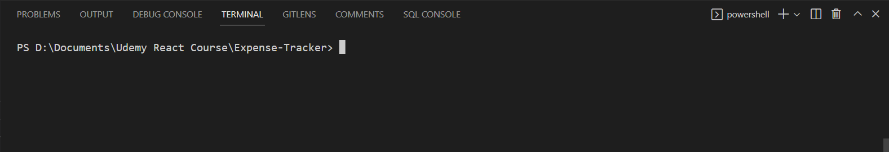
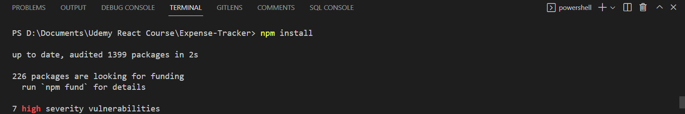
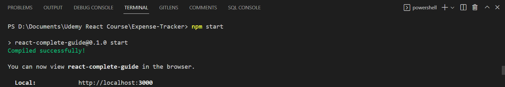

# Expense-Tracker
A simple React project created to become more familar with the React framework.

## Instructions

1. Navigate to root of directory

2. 'npm install' to install required modules

3. 'npm start' to start development server

